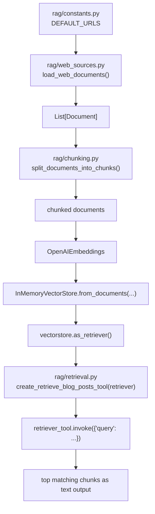

## Agentic Custom RAG

Simple retrieval pipeline over web content (Lilian Weng posts) using:
- web loading (`requests` + `BeautifulSoup`)
- chunking (`RecursiveCharacterTextSplitter`)
- embeddings (`OpenAIEmbeddings`)
- in-memory vector search (`InMemoryVectorStore`)

## How It Works (Chart)



Flow owner: `rag/web_loader.py` orchestrates this sequence end-to-end.

## Project Structure

- `rag/constants.py` - source URLs
- `rag/web_sources.py` - load documents from web pages
- `rag/chunking.py` - split documents into chunks
- `rag/retrieval.py` - build a retrieval tool from a retriever
- `rag/web_loader.py` - pipeline entrypoint / example run

## Setup

1. Install dependencies:

```bash
uv sync
```

2. Create `.env` in project root:

```env
OPENAI_API_KEY=your_key_here
```

## Run

```bash
uv run python rag/web_loader.py
```

You should see:
- a short retrieved text snippet
- `Loaded X documents`
- `Split into Y chunks`

## Notes

- `.env` is ignored by git to avoid committing secrets.
- `rag/web_loader.py` supports both:
  - `uv run python rag/web_loader.py`
  - module-style imports when used from package context
