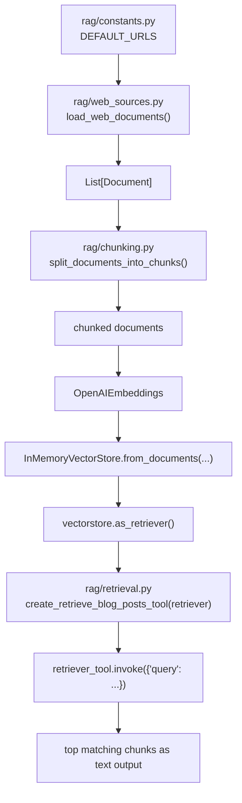

## Agentic Custom RAG

Simple retrieval pipeline over web content (Lilian Weng posts) using:
- web loading (`requests` + `BeautifulSoup`)
- chunking (`RecursiveCharacterTextSplitter`)
- embeddings (`OpenAIEmbeddings`)
- in-memory vector search (`InMemoryVectorStore`)

The LangGraph app is now organized in the recommended package layout with
`my_agent/` as the graph app root.

## How It Works (Chart)



Flow owner: `rag/web_loader.py` orchestrates this sequence end-to-end.

## Agent Workflow Graph

The LangGraph workflow (query -> retrieve -> grade -> rewrite/answer) is defined in
`rag/nodes/workflow_graph.py`.

Generated workflow image:


To regenerate the image:

```bash
uv run python rag/nodes/workflow_graph.py
```

## Project Structure

```text
my_agent/
├── utils/
│   ├── __init__.py
│   ├── tools.py      # env loading, LangSmith setup, retriever tool
│   ├── nodes.py      # graph node functions
│   └── state.py      # graph state definition
├── __init__.py
└── agent.py          # graph construction + run entrypoint
```

Other project files:
- `langgraph.json` - LangGraph graph configuration
- `requirements.txt` - pip-compatible dependency list
- `rag/` - supporting RAG modules (web loading, chunking, retrieval)
- `rag/nodes/workflow_graph.py` - compatibility wrapper to run/render graph from old path
- `rag/nodes/workflow_graph.png` - generated workflow visualization

## Setup

1. Install dependencies:

```bash
uv sync
```

2. Create `.env` in project root:

```env
OPENAI_API_KEY=your_key_here
LANGSMITH_API_KEY=your_langsmith_key_here
LANGSMITH_PROJECT=agentic-custom-rag
LANGSMITH_TRACING=true
```

## Run

```bash
uv run python rag/web_loader.py
```

You should see:
- a short retrieved text snippet
- `Loaded X documents`
- `Split into Y chunks`

Run the LangGraph workflow (with LangSmith tracing when key is set):

```bash
uv run python my_agent/agent.py
```

If `LANGSMITH_API_KEY` is present, runs are tracked in LangSmith under your project.

You can also run the compatibility wrapper:

```bash
uv run python rag/nodes/workflow_graph.py
```

## Notes

- `.env` is ignored by git to avoid committing secrets.
- `rag/web_loader.py` supports both:
  - `uv run python rag/web_loader.py`
  - module-style imports when used from package context
