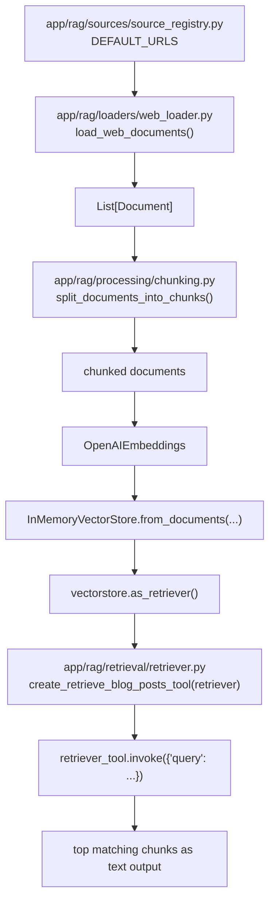
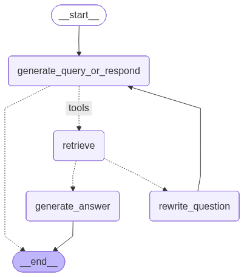

## Agentic Custom RAG

Simple retrieval pipeline over web content (Lilian Weng posts) using:
- web loading (`requests` + `BeautifulSoup`)
- chunking (`RecursiveCharacterTextSplitter`)
- embeddings (`OpenAIEmbeddings`)
- in-memory vector search (`InMemoryVectorStore`)

The LangGraph app is now organized in an app-centric production layout with
`app/` as the primary project root.

## How It Works (Chart)



Flow owner: `app/agents/graph.py` orchestrates this sequence end-to-end.

## Agent Workflow Graph

The LangGraph workflow (query -> retrieve -> grade -> rewrite/answer) is defined in
`app/agents/graph.py`.

Generated workflow image:



To regenerate the image:

```bash
uv run python app/main.py
```

## Project Structure

```text
app/
├── main.py
├── core/
│   ├── config.py
│   ├── constants.py
│   └── logging.py
├── api/
│   ├── routes.py
│   └── schemas.py
├── services/
│   └── rag_service.py
├── rag/
│   ├── loaders/
│   │   └── web_loader.py
│   ├── sources/
│   │   └── source_registry.py
│   ├── processing/
│   │   └── chunking.py
│   └── retrieval/
│       └── retriever.py
├── llm/
│   └── model.py
└── agents/
    ├── graph.py
    ├── state.py
    └── nodes/
        ├── retrieve_node.py
        ├── answer_node.py
        └── route_node.py
```

Other project files:
- `langgraph.json` - LangGraph graph configuration
- `requirements.txt` - pip-compatible dependency list
- `app/` - main application package

## Setup

1. Install dependencies:

```bash
uv sync
```

2. Create `.env` in project root:

```env
OPENAI_API_KEY=your_key_here
LANGSMITH_API_KEY=your_langsmith_key_here
LANGSMITH_PROJECT=agentic-custom-rag
LANGSMITH_TRACING=true
```

## Run

```bash
uv run python app/main.py
```

You should see:
- a short retrieved text snippet
- `Loaded X documents`
- `Split into Y chunks`

Run the LangGraph workflow (with LangSmith tracing when key is set):

```bash
uv run python app/main.py
```

If `LANGSMITH_API_KEY` is present, runs are tracked in LangSmith under your project.

## Notes

- `.env` is ignored by git to avoid committing secrets.
